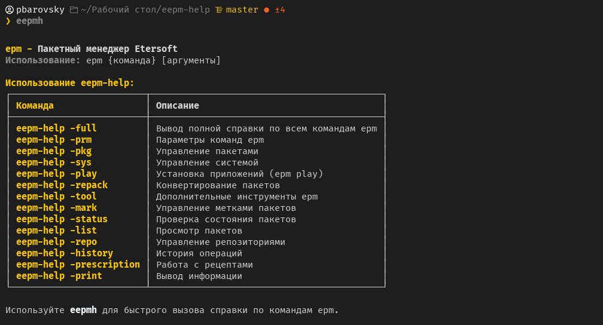
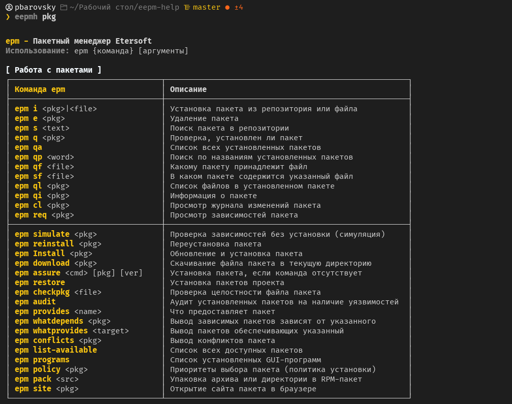

# eepm-help: справка по пакетному менеджеру EPM от Etersoft в терминале

[**Etersoft** — официальный сайт](https://etersoft.ru/)  
[**Данные взяты** с wiki Etersoft](https://wiki.etersoft.ru/Epm)  
[**Данные взяты** с Alt Linux wiki](https://www.altlinux.org/Epm)

`epm` — имеющая одинаковый интерфейс на всех системах команда управления пакетами. При интерфейсе, похожем на rpm, apt и urpm, выполняет необходимые операции на любой платформе.

## Что добавлено в справку

- параметры команд epm
- работа с системой
- работа с пакетами
- просмотр состояния пакетов (`epm status`)
- маркирование пакетов (`epm mark`)
- история управления пакетами (`epm history`)
- просмотр пакетов (`epm list`)
- управление источниками пакетов (`epm repo`)
- работа с приложениями (`epm play`)
- конвертирование пакетов (`epm repack`)
- работа с рецептами (`epm prescriptions`)
- вывод информации о пакетах и системе (`epm print`)
- работа со встроенными инструментами (`epm tool`), в частности:
  - `ercat`
  - `eget`
  - `erc`

> [!NOTE]
> Вызов утилиты коротким именем `eepmh` для удобства и скорости набора.

## Как это выглядит

Пример вызова `eepm-help` в терминале:





## Установка

1. Склонируйте репозиторий:

```bash
git clone https://github.com/pbarovsky/eepm-help.git
```

2. Перейдите в директорию

```bash
cd eepm-help
```

3. Выполните команду по установке

```bash
sudo chmod +x install.sh && ./install.sh
```

4. Перезапусти терминал или выполни

```bash
# если используешь zsh
source ~/.zshrc

# если используешь bash
source ~/.bashrc
```

## Удаление

1. Перейдите в директорию

```bash
cd eepm-help
```

2. Выполните команду по удалению

```bash
sudo chmod +x uninstall.sh && ./uninstall.sh
```

---

> [!NOTE]
> Скрипт работает в среде Linux с bash и zsh.

> [!WARNING]
> Проверь, что у Вас установлен `epm`.
