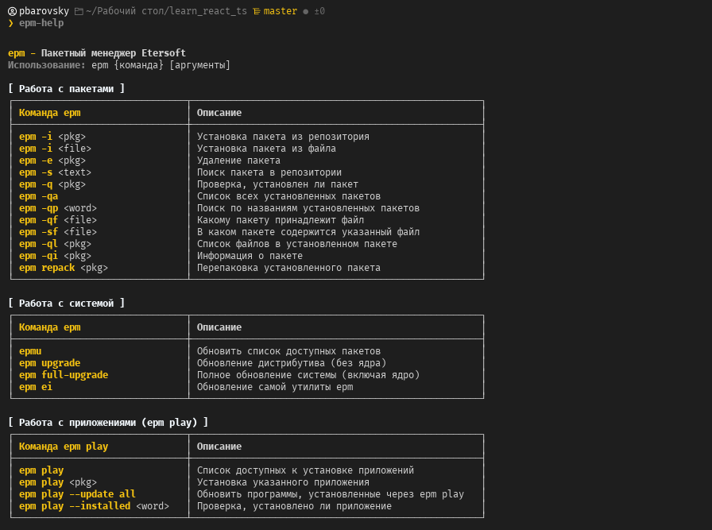

# eepm-help: справка по пакетному менеджеру EPM от Etersoft в терминале

[**Etersoft** — официальный сайт](https://etersoft.ru/)  
[**Данные взяты** с wiki Etersoft](https://wiki.etersoft.ru/Epm)  
[**Данные взяты** с Alt Linux wiki](https://www.altlinux.org/Epm)

`epm` — имеющая одинаковый интерфейс на всех системах команда управления пакетами. При интерфейсе, похожем на rpm, apt и urpm, выполняет необходимые операции на любой платформе.

Этот репозиторий содержит скрипт `install_epm_aliases.sh`, который добавляет удобную справку в файл настроек вашей оболочки (`.zshrc` и `.bashrc`):

- `eepm-help` — функция, выводящая справку по основным командам `epm`

## Что добавлено в справку

- работа с пакетами
- работа с системой
- работа с приложениями (`epm play`)
- конвертирование пакетов (`epm repack`)
- работа со встроенными инструментами (`epm tool`), в частности:
  - `ercat`
  - `eget`
  - `erc`

## Как это выглядит

Пример вызова `eepm-help` в терминале:



## Что делает скрипт

- Автоматически добавляет функцию `eepm-help` в `~/.zshrc` и `~/.bashrc`
- Проверяет, добавлены ли они уже, чтобы не дублировать

## Установка

1. Склонируйте репозиторий:

```bash
git clone https://github.com/pbarovsky/eepm-help.git
```

2. Перейдите в директорию

```bash
cd eepm-help
```

3. Сделайте скрипт исполняемым:

```bash
chmod +x install_epm_aliases.sh
```

4. Запустите скрипт

```bash
./install_epm_aliases.sh
```

5. Перезапусти терминал или выполни

```bash
source ~/.zshrc
# если используешь bash
source ~/.bashrc
```

6. Проверьте работу скрипта

```bash
eepm-help
```

---

> [!NOTE]
> Скрипт работает в среде Linux с bash или zsh.

> [!WARNING]
> Проверь, что у Вас установлен `epm`.
